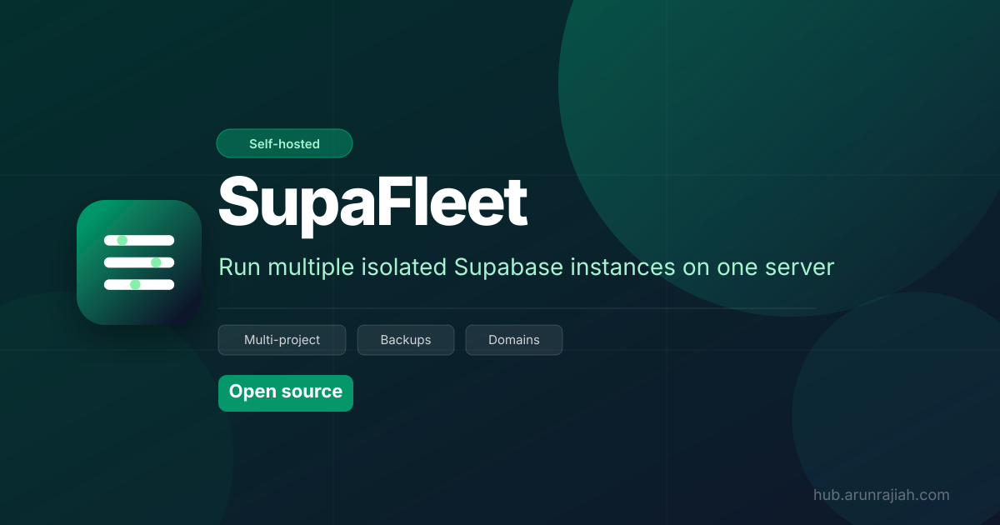

<p align="center">
  
</p>

<p align="center">
  
</p>

# supafleet

> Self-host **multiple isolated Supabase projects** on a single server — each with its own PostgreSQL database, Auth, REST API, and Storage — managed from a web UI.

[](LICENSE)
[](https://docs.docker.com/get-docker/)
[](CONTRIBUTING.md)

---

## Why

The official Supabase self-hosted setup gives you **one database per server**. If you want to host multiple apps or give different users their own isolated Supabase instance, you'd normally need a separate VM for each.

`supafleet` lets you run **N isolated tenants on one server** — each tenant gets:

- A dedicated **PostgreSQL database** (inside a shared Postgres instance)
- Its own **JWT secret** (no cross-tenant token reuse)
- Dedicated **PostgREST**, **GoTrue (Auth)**, and **Storage API** containers
- A subdomain: `myapp.yourdomain.com`

Everything is managed from a **web UI** — no SSH required after the first `docker compose up`.

---

## Architecture

```
One server
│
├── supabase-db        (PostgreSQL — all tenant databases live here)
├── supabase-imgproxy  (shared image processing)
├── supabase-nginx     (reverse proxy — port 80/443)
└── supabase-admin     (management UI — http://your-server-ip)
         │
         ├─ tenant: myapp   → rest-myapp / auth-myapp / storage-myapp
         ├─ tenant: client2 → rest-client2 / auth-client2 / storage-client2
         └─ ...
```

Each tenant is a separate Docker Compose stack joined to a shared Docker network.

---

## Requirements

| Tool | Version |
|---|---|
| Docker Engine | 24+ |
| Docker Compose | v2 |
| Python 3 | (for CLI scripts only) |

A **2 vCPU / 4 GB RAM** server comfortably handles ~14 tenants. Upsize for more.

---

## Quick start

```bash
# 1. Clone
git clone https://github.com/arunrajiah/supafleet.git
cd supafleet

# 2. Configure
cp .env.example .env
nano .env   # set POSTGRES_PASSWORD, JWT_SECRET, DOMAIN

# 3. Start  (pulls pre-built image from GHCR — no build step needed)
make up
# or: docker compose up -d

# 4. Open your browser
# → http://your-server-ip
# Set an admin password on first visit, then create databases from the UI.
```

Point `*.yourdomain.com` (wildcard DNS) at your server and each tenant will be reachable at `<name>.yourdomain.com`.

---

## Web UI

After `docker compose up`, open `http://your-server-ip` in a browser.

| Screen | Description |
|---|---|
| **Setup** | First-run: set an admin password |
| **Dashboard** | List all tenant databases with live container status |
| **New database** | Name your tenant, optionally override the site URL |
| **Tenant detail** | Copy API keys, endpoints, quick-start snippet; delete |
| **Container actions** | Restart individual services or upgrade containers to latest images — no SSH needed |

---

## CLI (alternative)

You can also manage tenants from the command line — useful for scripting or CI:

```bash
# Provision a new tenant
./scripts/add-tenant.sh myapp

# List all tenants and their container status
./scripts/list-tenants.sh

# Remove a tenant (keeps the database)
./scripts/remove-tenant.sh myapp

# Remove a tenant AND drop the database (irreversible)
./scripts/remove-tenant.sh myapp --drop-db
```

---

## Connecting your app

Each tenant exposes a standard Supabase-compatible API:

```js
import { createClient } from '@supabase/supabase-js'

const supabase = createClient(
  'http://myapp.yourdomain.com',   // shown in the admin UI
  'YOUR_ANON_KEY'                  // shown after creation
)
```

| Endpoint | Path |
|---|---|
| REST API | `/rest/v1/` |
| Auth | `/auth/v1/` |
| Storage | `/storage/v1/` |
| GraphQL | `/graphql/v1` |

---

## Configuration (`.env`)

| Variable | Description |
|---|---|
| `POSTGRES_PASSWORD` | Master Postgres password |
| `JWT_SECRET` | Default JWT secret (admin DB only — each tenant gets its own) |
| `JWT_EXPIRY` | Token TTL in seconds (default: 3600) |
| `DOMAIN` | Base domain — tenants live at `<name>.$DOMAIN` |
| `SMTP_HOST` / `SMTP_PORT` / `SMTP_USER` / `SMTP_PASS` | Shared SMTP for auth emails |
| `SMTP_ADMIN_EMAIL` | Sender address |
| `ENABLE_EMAIL_AUTOCONFIRM` | Skip email verification (`true`/`false`) |

---

## Capacity planning

| Server | RAM | Tenants |
|---|---|---|
| 2 vCPU / 2 GB | 2 GB | ~6 |
| 2 vCPU / 4 GB | 4 GB | ~14 |
| 4 vCPU / 8 GB | 8 GB | ~30 |

Each tenant uses ~250 MB RAM (rest + auth + storage containers). Shared services use ~300 MB base.

---

## Documentation

| Guide | Audience |
|---|---|
| [Getting Started](docs/getting-started.md) | Install on a fresh server, first tenant |
| [Configuration](docs/configuration.md) | All `.env` variables, `versions.json` reference |
| [Managing Tenants](docs/managing-tenants.md) | Create, inspect, delete tenants via UI and CLI |
| [HTTPS Setup](docs/https.md) | Caddy (auto-certs) and Nginx + Certbot |
| [Backup & Restore](docs/backup-restore.md) | Database dumps, storage backups, migration |
| [Architecture](docs/architecture.md) | How it works: containers, networking, JWT isolation |
| [Local Development](docs/local-development.md) | Dev setup, API reference, adding features |
| [FAQ](docs/faq.md) | Common questions |

---

## Updating Supabase versions

All service image tags are defined in a single [`versions.json`](versions.json) file at the project root.

To upgrade a tenant's containers to new image versions:
1. Update the tags in `versions.json` (or merge a Renovate PR — it opens these automatically)
2. Open the tenant's detail page in the admin UI → **Services → Actions → ↑ Upgrade services**

The upgrade pulls the new images, stops the old containers, and recreates them. Data is never touched.

[Renovate](https://docs.renovatebot.com/) is pre-configured (`.github/renovate.json`) to open automated PRs when new image versions are released.

---

## HTTPS / TLS

For production, put Caddy or Nginx with Certbot in front:

```bash
# Example with Caddy (add caddy service to docker-compose.yml)
*.yourdomain.com {
    reverse_proxy supabase-nginx:80
}
```

See [`docs/https.md`](docs/https.md) for a step-by-step guide.

---

## Contributing

Contributions are welcome! See [CONTRIBUTING.md](CONTRIBUTING.md) for guidelines.

---

## Security

Found a vulnerability? Please report it privately — see [SECURITY.md](SECURITY.md).

---

## Attribution

Portions of this project are derived from [supabase/supabase](https://github.com/supabase/supabase),
Copyright © Supabase, Inc., licensed under the [Apache License 2.0](https://www.apache.org/licenses/LICENSE-2.0).

Files derived from that project:
- `volumes/db/jwt.sql`
- `volumes/db/roles.sql`
- `volumes/db/webhooks.sql`
- `volumes/db/logs.sql`
- `volumes/db/pooler.sql`
- `volumes/db/realtime.sql`

See [NOTICE](NOTICE) for full attribution details.

---

## License

[MIT](LICENSE) © 2025 Arun Rajiah

---

> **Not affiliated with Supabase, Inc.** This is an independent community project.
> Supabase is a trademark of Supabase, Inc.
